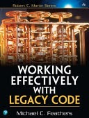

GEE Plugin: Lessons Learned<!-- .element: class="r-fit-text" -->


NOTE: This is only visible to the presenter.

Press <kbd>S</kbd> to open speaker view.

Drag this tab to a different window or screenshare the other tab. When you change slides on this presenter-view tab, the other tab with audience focused tabs will change as well.

Brings Earth Engine into QGIS — cloud + desktop
Load satellite data (Sentinel, Landsat, etc.)
Filter and style imagery interactively
Export data from Earth Engine for your own analysis

---

Tools to improve the planet.


<span class="fragment" style="position: absolute; bottom: 10px; right: 10px;">
  
</span>


NOTE:

Outsiders to the community though we've been involved with FOSS4G for 20 years.


---

Goal: Bring Earth Engine to QGIS ecosystem <!-- .element: class="r-fit-text" -->

---

```python
import ee
from ee_plugin import Map

image = ee.Image('USGS/SRTMGL1_003')
vis_params = {
    'min': 0, 'max': 4000,
    'palette': ['006633', 'E5FFCC', '662A00', 'D8D8D8', 'F5F5F5']
}
Map.addLayer(image, vis_params, 'Digital Elevation Model')
Map.setCenter(-121.753, 46.855, 9)
```

---


NOTE:

Example using the SRTM elevation dataset, users can add data to the map via QGIS python editor in a similar way to EE's code editor.
We wanted to increase the number of users who could use the plugin without having to write Python code. 

---

New Goal: Bring Earth Engine to more QGIS users <!-- .element: class="r-fit-text" -->

---


NOTE: Main method was to leverage QGIS native tools to generate dialogs that users are used too

---


NOTE: Using these default tools also enables integration into other tools like the processing toolbox, QGIS logging, and the Model Builder.

---

<!-- .slide: data-background-video="assets/esa_world_cover_demo.mp4" data-background-video-loop data-background-video-muted -->


NOTE: Here's another example where most parameters are kept empty to use Google's smart defaults in terms of styling. 

---

## What's new?

- Add, style, filter, and export
- Processing toolbox
- Model Builder

---

The plugin ecosystem is complex

NOTE:

- Best practices are spread out/varied
- C++ bindings make Python API and docs integration diffcult
- Intricacies in developing with Qt (particurlarly around signals)
- There's few open gold standard examples or guides

---

Spread out best practices

NOTE: 
TODO: make lists of best resources

---

C++ bindings 

---

DevEx with Qt

NOTE: particurlarly around signals
skills gap 
interest gap

---
 
Few open gold standard community examples

NOTE:

(of the top 20 plugins, 4 had a test suite.)

---

## Lessons learned

---

**Lesson 1: Use good development practices** <!-- .element: class="r-fit-text" -->

debugger, testing, CI, testing env.

NOTE: Give a quick node to dependency bloat and plugins being limited to 25MB

---

### Core Tools

- [pytest-qgis](https://github.com/GispoCoding/pytest-qgis/tree/main)
- [DebugVS](https://plugins.qgis.org/plugins/debug_vs/)
- [GitHub Actions](https://github.com/features/actions)

---


---

<!-- .slide: data-background-video="assets/CI_demo.mp4" data-background-video-loop data-background-video-muted -->

---

“Legacy Code is code without tests”



<span style="position: absolute; bottom: 10px; right: 10px;">
  
</span>

---

**Lesson 2: Use `QgsProcessingAlgorithm` until you can't!** <!-- .element: class="r-fit-text" -->

docs, logs, toolbox and model builder

---

`QgsProcessingAlgorithm` definition:
<span class="fragment">`shortHelpString`</span>

<span class="fragment">`name`</span>

<span class="fragment">`displayName`</span>

<span class="fragment">`group`</span>

<span class="fragment">`groupId`</span>

NOTE: built in docs!

---

Core algorithm logic:

```python 
  def processAlgorithm(
        self,
        parameters: dict,
        context: QgsProcessingContext,
        feedback: QgsProcessingFeedback,
    )
  ```
---

Parameter definition:
```python
initAlgorithm(self, config: dict):
  self.addParameter(...)
  ...
  self.addOutput(...)
```

---


---


---

Default rendering of parameters <!-- .element: class="r-fit-text" -->

<span class="fragment">What if you need a complex data type?</span>  
<span class="fragment">Or to dynamically populate data like a dropdown?</span>

NOTE: Probably the hardest and most interesting part of the development of the plugin

---

Lesson 3: Custom algorithm dialogs when `QgsProcessingAlgorithm` isn't enough

---

`BaseAlgorithmDialog` structure:
- Subclass of `QgsProcessingAlgorithmDialogBase`
- Creates a custom Qt layout
- Interactive and nested parameter inputs

---

Core entry points:

```python
def buildDialog(self) -> QWidget:
    # Build and return your custom layout here
```

```python
def getParameters(self) -> Dict:
    # Return cleaned parameters for the algorithm
```

NOTE: 

- getParameters is where we can enable support for much more complex data types
- buildDialog is where we can control more advanced formatting of the UI

---

Benefits:
- Full control over UI
- Populate dropdowns 
- Custom widgets 

NOTE: (band selection, filters, available layers, etc.), Embed custom widgets (percentile slider, lists of filters, etc.)

---


---

## What’s Next

- 🔍 Earth Engine Catalog
- 💬 Listen to Users

---

📘 QGIS Plugin Dev Guide? Come say hello:


---

### Acknowledgments

- Ujaval Gandhi: Early feedback for last release
- Gennadii Donchyts: Initial plugin development
- Alicia Sullivan: Project management and user feedback
- Anthony Lukach: Core Developer

---

<section>

  Thank you! 

  <h3>Try out the plugin</h3>

  

  <span class="fragment" style="position: absolute; bottom: -80px; right: -80px;">
    
  </span>
</section>